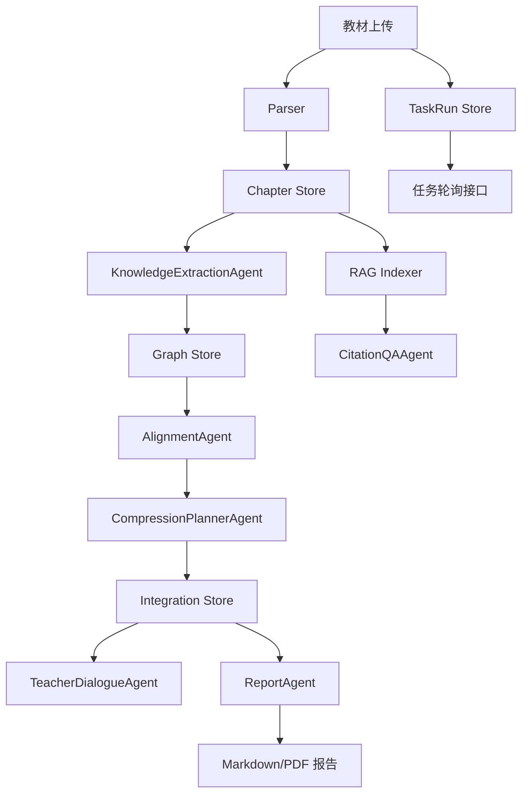

# 系统设计

## 架构总览

## 技术选型

- FastAPI：适合文件上传、长任务接口和 Python AI 生态。
- SQLite：比赛单用户场景足够，部署简单。
- PyMuPDF：逐页解析 PDF，支持页码元数据。
- sentence-transformers + FAISS/BM25：本地中文向量检索和关键词召回。
- React/Vite + Cytoscape.js：实现 SPA 和可交互知识图谱。
- Playwright PDF：从 HTML 导出整合报告 PDF，保证 Markdown 和 PDF 同源。

## API 一览

| API | 用途 |
| --- | --- |
| `POST /api/textbooks/upload` | 上传教材并启动后台解析任务 |
| `GET /api/textbooks` | 查询教材和章节 |
| `POST /api/graphs/build` | 启动单本教材图谱任务 |
| `GET /api/graphs/{textbook_id}` | 查询单本图谱 |
| `POST /api/integration/run` | 启动跨教材整合任务 |
| `GET /api/integration` | 查询整合图谱和决策 |
| `POST /api/rag/index` | 启动 RAG 索引任务 |
| `GET /api/rag/status` | 查询索引状态 |
| `POST /api/rag/query` | 带引用问答 |
| `POST /api/dialogue/message` | 教师反馈修订 |
| `GET /api/report/integration` | 读取 Markdown 报告预览 |
| `POST /api/report/pdf/build` | 启动 PDF 报告生成任务 |
| `GET /api/report/pdf` | 导出 PDF 报告 |
| `GET /api/tasks` | 查询后台任务列表 |
| `GET /api/tasks/{task_id}` | 查询后台任务详情 |

## 数据流

上传教材后，后端先创建 `TaskRun` 并立即返回 `202 Accepted`。后台任务再执行 Parser、图谱构建、整合、RAG 建索引或 PDF 报告生成，并把进度、错误摘要和结果引用写回 `TaskRun Store`。前端通过轮询 `GET /api/tasks` / `GET /api/tasks/{task_id}` 恢复和更新工作流状态。图谱构建读取章节，生成知识节点和关系；整合模块读取所有节点，先做 embedding 召回，再做 LLM 复核，生成整合决策；RAG 模块按章节分块并建立索引，回答时只使用检索 chunk；报告模块从数据库统计生成 Markdown，并在后台派生 PDF。

## 图谱呈现

后端图谱接口保持 `nodes` 和 `edges` JSON 结构，同时为节点补充章节标题、章节顺序、页码范围和抽取 metrics。前端通过 GraphPresentation 将同一份知识图谱数据转换为两种可视化：默认的章节思维导图按教材、章节和知识点分层规整排列；关系网络保留 Cytoscape 力导向布局，用于查看跨章节关系密度。两种视图共享搜索、高亮、缩放、拖拽和点击详情能力。

节点点击只更新选中状态和右侧详情，不重新执行布局或 `fit`，以保留教师当前放大的观察位置。节点填充色使用同一蓝色梯度表达跨教材出现频次，节点尺寸同步随频次增大；教材来源改由节点边框色、图例和详情面板来源列表表达，避免来源颜色干扰频次深浅判断。图谱状态区会显示 LLM 抽取或关键词降级抽取状态，未配置真实 LLM 时提醒当前知识点质量有限。
