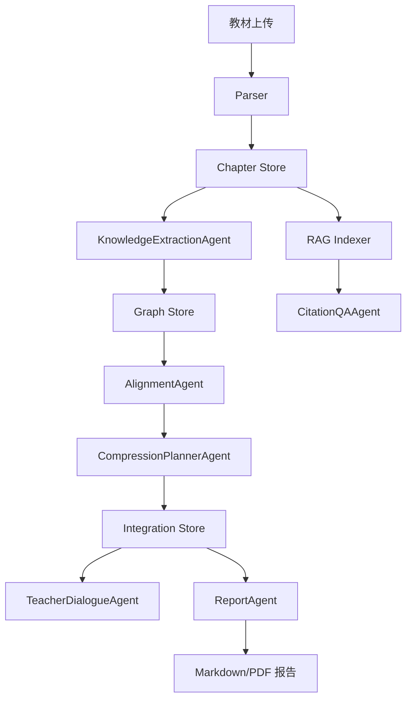

# 系统设计

## 架构总览

## 技术选型

- FastAPI：适合文件上传、长任务接口和 Python AI 生态。
- SQLite：比赛单用户场景足够，部署简单。
- PyMuPDF：逐页解析 PDF，支持页码元数据。
- sentence-transformers + FAISS/BM25：本地中文向量检索和关键词召回。
- React/Vite + Cytoscape.js：实现 SPA 和可交互知识图谱。
- Playwright PDF：从 HTML 导出整合报告 PDF，保证 Markdown 和 PDF 同源。

## API 一览

| API | 用途 |
| --- | --- |
| `POST /api/textbooks/upload` | 上传并解析教材 |
| `GET /api/textbooks` | 查询教材和章节 |
| `POST /api/graphs/build` | 构建单本教材图谱 |
| `GET /api/graphs/{textbook_id}` | 查询单本图谱 |
| `POST /api/integration/run` | 跨教材整合 |
| `GET /api/integration` | 查询整合图谱和决策 |
| `POST /api/rag/index` | 建立 RAG 索引 |
| `GET /api/rag/status` | 查询索引状态 |
| `POST /api/rag/query` | 带引用问答 |
| `POST /api/dialogue/message` | 教师反馈修订 |
| `GET /api/report/integration` | 生成 Markdown 报告 |
| `GET /api/report/pdf` | 导出 PDF 报告 |

## 数据流

上传教材后，Parser 解析出章节并落库。图谱构建读取章节，生成知识节点和关系。整合模块读取所有节点，先做 embedding 召回，再做 LLM 复核，生成整合决策。RAG 模块按章节分块并建立索引，回答时只使用检索 chunk。报告模块从数据库统计生成 Markdown，并派生 PDF。

